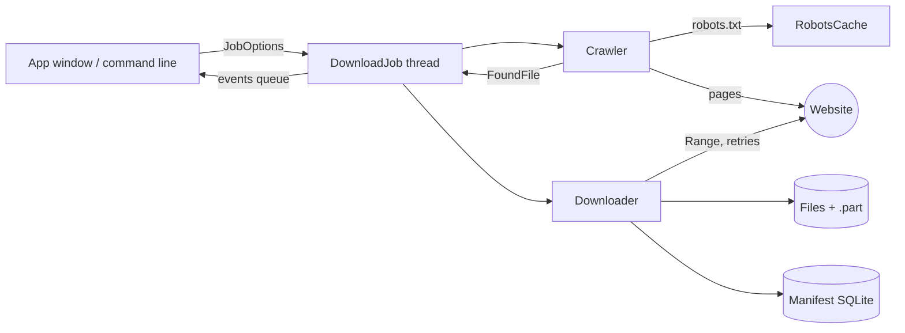

# How it works

```mermaid
flowchart LR
    UI[App window / command line] -->|JobOptions| J[DownloadJob thread]
    J --> C[Crawler]
    C -->|robots.txt| R[RobotsCache]
    C -->|pages| W((Website))
    C -->|FoundFile| J
    J --> D[Downloader]
    D -->|Range, retries| W
    D --> F[(Files + .part)]
    D --> M[(Manifest SQLite)]
    J -->|events queue| UI
```
